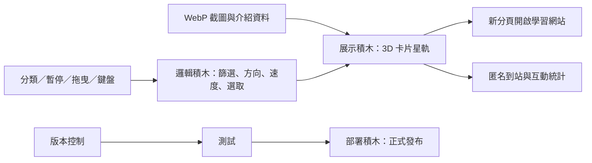

# 自學星圖

大乃老師遊戲化自學網站的滿版 3D 入口。使用者可用滑鼠方向、拖曳、按鈕或鍵盤方向鍵轉動卡片星軌；停留時查看網站說明，點擊卡片後在新分頁開啟目標網站。

正式網站（三平台同步）：

- Cloudflare Pages：[https://self-learning-orbit.pages.dev](https://self-learning-orbit.pages.dev)
- Vercel：[https://self-learning-orbit.vercel.app](https://self-learning-orbit.vercel.app)
- Netlify：[https://self-learning-orbit.netlify.app](https://self-learning-orbit.netlify.app)

## 功能

- 17 個遊戲化自學網站，使用實際網站畫面。
- 老師／家長兩步快速選站，依使用目標推薦 1–3 座網站。
- 左上方快速工具可直接前往「自學複利護照」。
- 全部網站總覽，一次比較年段、玩法與建議使用時間。
- 全部、國語文、自我領導、教師成長、數理英五種快速分類。
- 桌機約 5–6 秒、手機約 8 秒一站的自動巡航，可明確暫停、恢復並保存偏好。
- 滑鼠方向控制、拖曳、觸控、左右按鈕與鍵盤方向鍵。
- WebP 縮圖分階段載入，首屏只載入中央附近 5 張。
- 支援 `prefers-reduced-motion`。
- GoatCounter 匿名到站統計與必要互動事件，不蒐集個人資料。
- 頁面直接顯示目前在線、今日到訪與累積到訪；以匿名工作階段計數，不使用帳號、Cookie、IP 或個人資料。
- 16 座學習網站的右下角共用工具預設收合成單一按鈕，需要時再展開「家庭共學」、「學習紀錄」、「自學星圖」與公開計數；六書造字堂首次造訪會先展開一次，避免入口難以發現。
- 16 座網站共用「學習紀錄」入口，提供學生、家長、教師 60 秒使用說明、身分狀態、本機自動保存提示與進度摘要。
- 使用 20 位學習護照碼跨裝置續玩；快照先以 AES-GCM 在裝置內加密，伺服器只保存密文與不可逆同步識別碼。
- 每站採學習進度白名單同步；班級代碼、姓名、PIN 與原有登入／同步憑證不會上傳。
- P1 家庭共學把「陪孩子一起學」與「家長自己體驗」分開，最多建立 8 位孩子檔案，並提供拍拍、鼓勵與補充能量。
- P2 教師課堂只補在尚無原生班級功能的 6 站，提供六位數班級碼、免註冊暱稱加入、個人／分組／討論模式、計時、暫停、揭曉與安全投影。
- 課堂投影只顯示參與人數、作答分布與團隊成果；姓名、個別答案與錯誤只出現在教師私密明細。
- P3 可匯入各平台目前顯示的文字題目、保存最多 100 道教師題庫，並保留最近 50 份課堂報告與安全 CSV 匯出。
- 孩子檔案支援改名、刪除後復原與切換前確認；家庭鼓勵可用同一組護照端對端加密跨裝置傳送。
- 分組模式支援 2–12 組自動分派、每組第一份答案鎖定與投影合作能量。
- 本機家庭、護照及課堂資料提供雙重確認的一次清除，且不會連帶刪除遊戲進度。

## 本機預覽

直接開啟 `index.html`，或在此資料夾啟動任何靜態檔案伺服器。

```sh
npx serve .
```

## 驗證

```sh
npm run check
```

## 網站積木

| 角色區 | 積木 | 必要性 | 單一職責 | 輸入 → 輸出 | 實作 | 驗收 |
|---|---|---|---|---|---|---|
| 入口 | 展示積木 | 必要 | 呈現 3D 卡片、快速選站、總覽與操作回饋 | 網站資料 → 可操作入口 | HTML / CSS | 滿版、響應式、鍵盤可操作 |
| 守門＋調度 | 邏輯積木 | 必要 | 控制受眾推薦、分類、旋轉、暫停與網址開啟 | 選站／指標事件 → 推薦與卡片狀態 | 原生 JavaScript | 兩步推薦、自動巡航、暫停、分類 |
| 工具箱 | 檔案積木 | 必要 | 保存經驗收的網站畫面 | 公開網站 → WebP 縮圖 | `assets/previews/` | 17 張截圖分階段載入 |
| 工具箱 | 連線積木 | 必要 | 記錄匿名到站與互動數據 | 頁面事件 → GoatCounter | 前端匿名事件 | 失敗不影響入口功能 |
| 地基 | 版本控制積木 | 必要 | 保存與回溯原型 | 專案檔案 → 可追蹤版本 | Git | 無機密、文件完整 |
| 地基 | 部署積木 | 必要 | 對外發布入口網站 | 靜態網站 → 公開網址 | Cloudflare Pages / Vercel / Netlify | 三個 production 可存取 |



## 檔案結構

```text
self-learning-orbit/
├── functions/api/
│   ├── _presence-core.js
│   └── presence.js
├── index.html
├── styles.css
├── app.js
├── schema.sql
├── wrangler.toml
├── _routes.json
├── package.json
├── README.md
├── test/
│   └── portal.test.mjs
└── assets/
    └── previews/
        └── *.webp
```

## 公開計數口徑

- 目前在線：最近 5 分鐘內仍有活動的匿名工作階段。
- 今日到訪：依台灣時間計算，當日首次開啟的匿名工作階段。
- 累積到訪：自 2026 年 7 月 27 日啟用後的匿名工作階段總數。
- 同一分頁重新整理不重複累加；不同分頁或瀏覽器會視為不同工作階段。
- 三個正式鏡像共用 Cloudflare Pages Function 與獨立 D1 資料庫，畫面數字一致。

## 16 站共用公開計數服務

`platform-counter.js` 是 16 座自學平台共用的右下角元件，包含返回「自學星圖」的入口與公開計數器。各站只需傳入固定的 `data-site`，即可讀取 `/api/platform-presence`；資料共用同一個 D1，但依站點識別碼分開統計，不會和自學星圖入口或其他平台混算。為配合 20 分鐘心跳並節省免費額度，各學習平台的「目前在線」採最近 30 分鐘仍有活動的匿名工作階段；自學星圖入口本身維持上方所列的 5 分鐘口徑。

## 13 個考科站共用公開計數服務

`exam-counter.js` 提供會考 5 科、學測 5 科、統測 3 科共用的右下角匿名統計卡，顯示目前在線、今日到訪與累積到訪。各站以固定 `data-site` 呼叫同一個 `/api/platform-presence`，資料依站點分開統計；同一分頁使用 `sessionStorage` 維持匿名工作階段，不建立帳號或跨站追蹤。考科站統計自 2026 年 8 月 3 日起算。

## 16 站共用學習護照

`platform-counter.js` 會依 `data-site` 載入 `learning-passport.js`，在各平台提供一致的學習紀錄中心：

- 「開始／繼續學習」取代容易誤會的分頁連結概念，並明確說明不必保存分頁。
- 顯示本機學習者、已連結學習護照或班級學習狀態，以及本機與雲端保存時間。
- 由 `learning-passport-core.js` 依站點白名單讀取可攜式學習進度，排除敏感或班級管理資料。
- 上傳前以護照碼衍生 AES-GCM 金鑰；`/api/learning-sync` 只接收密文、IV 與 SHA-256 同步識別碼。
- 使用者主動按下「同步到雲端」才會上傳；取回前會確認，避免意外覆蓋本機進度。
- 加密快照保存 400 天；護照碼不會傳給伺服器，遺失後無法代為找回。

## P1 家庭共學

`family-classroom.js` 會依站點白名單保存每一位家庭成員的進度快照：

- 家長選「陪孩子一起學」時，作答寫入指定孩子檔案。
- 家長選「家長自己體驗」時，使用獨立沙盒，不改動孩子進度。
- 切換孩子前會先保存目前進度，再載入目標孩子的快照並重新整理。
- 家庭檔案會跟著學習護照一起在裝置內加密，可讓孩子換到自己的裝置接手。
- 鼓勵事件只有「拍拍／鼓勵／補充能量」，不建立家長排名或責備式錯題通知。

## P2 教師課堂

`/api/classroom` 使用同一個 Cloudflare D1 提供 12 小時即時課堂：

- 原生優先：文心雕龍、文豪笑傳、文言解憂站、心之深淵、字鬥英雄、字字珠璣、步學吾數、科學英雄、梁山閱征記已有對戰、班級、教師後台或課堂設計，共用元件只顯示家庭共學，避免產生第二套班級紀錄。
- 共用課堂只顯示於拂曉密令、習慣養成工廠、凡人煉心訣、良師養成記、新手導師養成記、形音鬥士。
- 教師以私密權杖建立六位數班級碼，設定題目、選項、解析、模式與計時。
- 學生只需班級碼與暱稱，不需要一般註冊；分組模式可填組別。
- 每題以題目版本隔離答案，教師可暫停、繼續、揭曉或結束課堂。
- 公開輪詢結果不含暱稱、匿名裝置識別碼或個別答案。
- 教師通過權杖驗證後，才可在私密明細看到個別作答。

## P3 題庫、報告、家庭管理與分組深化

- 「匯入目前平台題目」只讀取畫面中可見、至少含兩個文字選項的題目；圖片或 Canvas 題目不猜測，改由老師手動輸入。
- 教師題庫與課堂歷史只保存在目前瀏覽器，分別限制最近 100 道與 50 份；CSV 下載會處理試算表公式注入風險。
- 孩子刪除後會把姓名、鼓勵與進度快照一起放入可復原區；刪除目前使用者時先切回家長體驗。
- 家庭跨裝置鼓勵沿用 20 位護照衍生的 AES-GCM 金鑰，`/api/family-cheers` 只保存最多 30 天的密文、IV、事件識別碼與不可逆護照雜湊。
- 課堂分組可自動輪流分派；啟用組別鎖定後，每題同組只接受第一份答案。
- 原生 `<dialog>`、鍵盤焦點提示、狀態即時區與 `prefers-reduced-motion` 用於降低鍵盤及動態操作障礙。

三角色操作與斷線、換裝置等驗收情境見 [`FAQ.md`](./FAQ.md)。

## 網址資料說明

- 已將使用者提供的重複網址合併，共收錄 17 個可正常開啟的網站。
- 原始文字中的 `ges.dev/index.html` 不具完整網域，未納入本版，避免猜測錯誤。
- 網站截圖為建立入口時的公開首頁畫面，網站更新後可重新擷取替換。
- 首屏載入中央附近 5 張，其餘在接近前景時載入。
