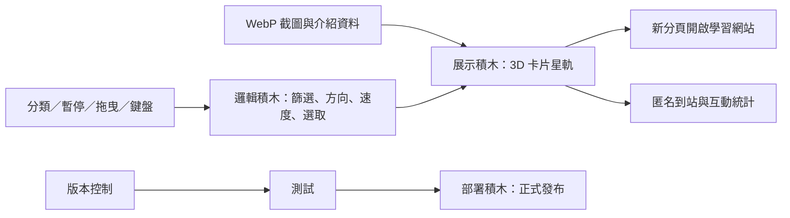

# 自學星圖

大乃老師遊戲化自學網站的滿版 3D 入口。使用者可用滑鼠方向、拖曳、按鈕或鍵盤方向鍵轉動卡片星軌；停留時查看網站說明，點擊卡片後在新分頁開啟目標網站。

正式網站：[https://self-learning-orbit.vercel.app](https://self-learning-orbit.vercel.app)

## 功能

- 13 個遊戲化自學網站，使用實際網站畫面。
- 老師／家長兩步快速選站，依使用目標推薦 1–3 座網站。
- 全部網站總覽，一次比較年段、玩法與建議使用時間。
- 全部、國語文、自我領導、教師成長、數理英五種快速分類。
- 桌機約 5–6 秒、手機約 8 秒一站的自動巡航，可明確暫停、恢復並保存偏好。
- 滑鼠方向控制、拖曳、觸控、左右按鈕與鍵盤方向鍵。
- WebP 縮圖分階段載入，首屏只載入中央附近 5 張。
- 支援 `prefers-reduced-motion`。
- GoatCounter 匿名到站統計與必要互動事件，不蒐集個人資料。

## 本機預覽

直接開啟 `index.html`，或在此資料夾啟動任何靜態檔案伺服器。

```sh
npx serve .
```

## 驗證

```sh
npm run check
```

## 網站積木

| 角色區 | 積木 | 必要性 | 單一職責 | 輸入 → 輸出 | 實作 | 驗收 |
|---|---|---|---|---|---|---|
| 入口 | 展示積木 | 必要 | 呈現 3D 卡片、快速選站、總覽與操作回饋 | 網站資料 → 可操作入口 | HTML / CSS | 滿版、響應式、鍵盤可操作 |
| 守門＋調度 | 邏輯積木 | 必要 | 控制受眾推薦、分類、旋轉、暫停與網址開啟 | 選站／指標事件 → 推薦與卡片狀態 | 原生 JavaScript | 兩步推薦、自動巡航、暫停、分類 |
| 工具箱 | 檔案積木 | 必要 | 保存經驗收的網站畫面 | 公開網站 → WebP 縮圖 | `assets/previews/` | 13 張截圖分階段載入 |
| 工具箱 | 連線積木 | 必要 | 記錄匿名到站與互動數據 | 頁面事件 → GoatCounter | 前端匿名事件 | 失敗不影響入口功能 |
| 地基 | 版本控制積木 | 必要 | 保存與回溯原型 | 專案檔案 → 可追蹤版本 | Git | 無機密、文件完整 |
| 地基 | 部署積木 | 必要 | 對外發布入口網站 | 靜態網站 → 公開網址 | Vercel | production 可存取 |



## 檔案結構

```text
self-learning-orbit/
├── index.html
├── styles.css
├── app.js
├── package.json
├── README.md
├── test/
│   └── portal.test.mjs
└── assets/
    └── previews/
        └── *.webp
```

## 網址資料說明

- 已將使用者提供的重複網址合併，共收錄 13 個可正常開啟的網站。
- 原始文字中的 `ges.dev/index.html` 不具完整網域，未納入本版，避免猜測錯誤。
- 網站截圖為建立入口時的公開首頁畫面，網站更新後可重新擷取替換。
- 首屏載入中央附近 5 張，其餘在接近前景時載入。
